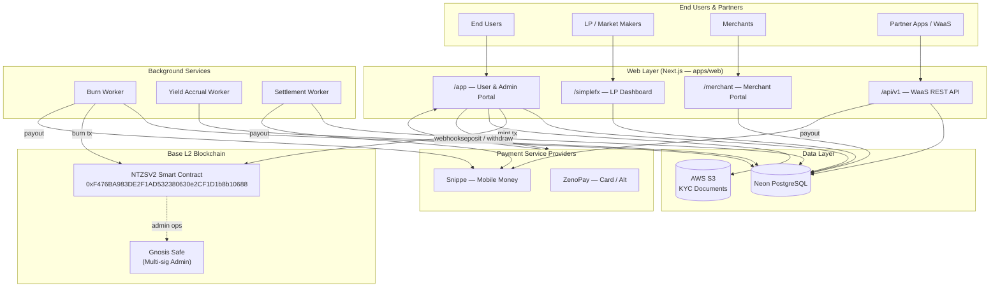
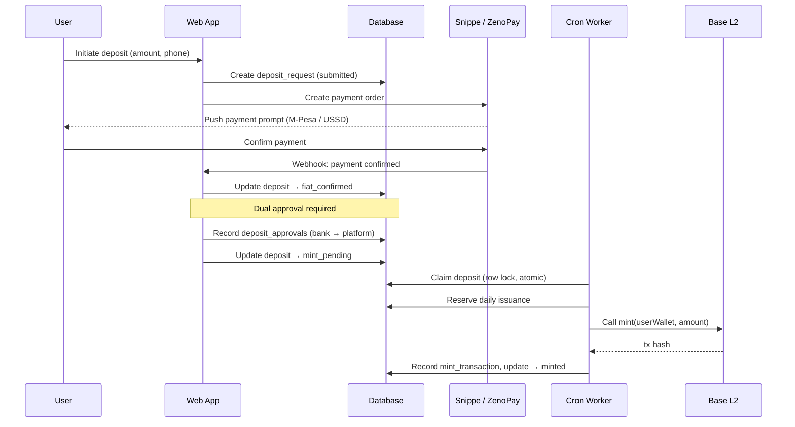
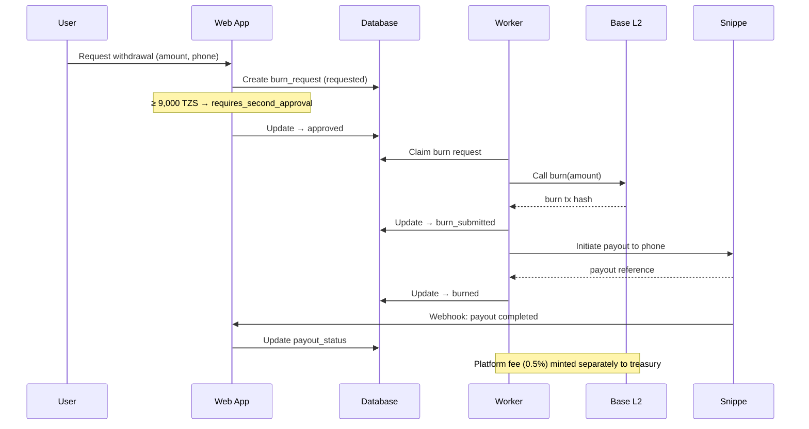
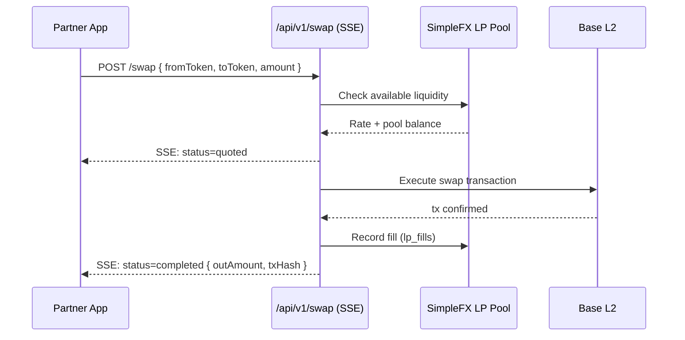
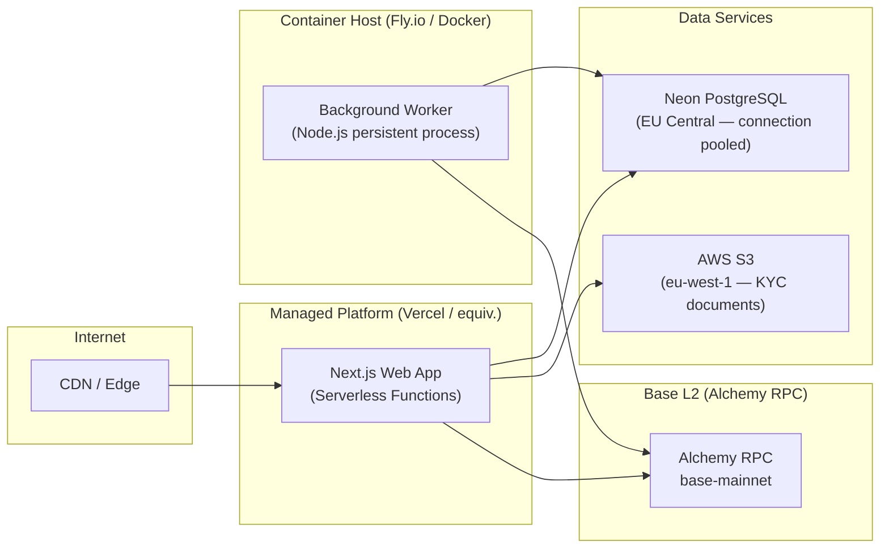

# 01 — System Architecture

**Document owner**: NEDA Labs Limited  
**Last updated**: May 2026  
**Classification**: Regulatory — Bank of Tanzania Sandbox Submission

---

## 1. Overview

nTZS is a Tanzanian Shilling-referenced stablecoin issued by **NEDA Labs Limited** on the **Base L2 blockchain** (Coinbase, OP Stack, settles to Ethereum mainnet). Each token is backed 1:1 by TZS held in segregated reserve accounts.

The platform consists of five logical sub-systems operating together:

| Sub-system | Purpose |
|---|---|
| **Web Application** | End-user portal, admin dashboard, compliance oversight, merchant portal |
| **SimpleFX LP Portal** | Liquidity provider onboarding and FX pool management |
| **Background Worker** | Asynchronous burn processing, yield accrual, settlement |
| **Smart Contracts** | On-chain token (NTZSV2), access control, supply enforcement |
| **Database** | PostgreSQL — authoritative off-chain record of all platform activity |

---

## 2. High-Level System Diagram

---

## 3. Component Descriptions

### 3.1 Web Application (`apps/web`)

Built with **Next.js 15** (App Router, React Server Components). Deployed as a single service on a managed platform (Vercel-compatible).

| Route Group | Audience | Function |
|---|---|---|
| `/app` | End users, admins | Deposit, withdraw, transfer, KYC, wallets |
| `/app/oversight` | Compliance / Super Admin | Real-time supply, reserves, KYC pipeline, audit log |
| `/app/backstage` | Super Admin | User management, manual approvals, enforcement actions |
| `/simplefx` | Liquidity Providers | LP wallet, spreads, pool dashboard, fills |
| `/merchant` | Merchants | Payment links, collections, settlement |
| `/api/v1` | Partner apps | WaaS REST API — deposits, withdrawals, swaps, transfers |
| `/api/cron` | Cron scheduler | Scheduled tasks: mint processing, PSP polling, yield accrual |
| `/api/webhooks` | PSP callbacks | Snippe payment/payout webhooks, ZenoPay webhooks |

### 3.2 Background Worker (`apps/worker`)

A long-running Node.js process deployed as a persistent container. Handles:

- **Burn processing**: Monitors approved burn requests, executes on-chain `burn()`, triggers Snippe payout
- **Yield accrual**: Daily accrual of savings product interest across active positions
- **Merchant settlement**: Batches merchant collections ≥ 5,000 TZS into Snippe payouts
- **Platform fee minting**: Mints platform fee (0.5% of burn amount) to treasury wallet

### 3.3 Smart Contracts (`packages/contracts`)

| Contract | Chain | Address | Version |
|---|---|---|---|
| nTZS Token | Base Mainnet | `0xF476BA983DE2F1AD532380630e2CF1D1b8b10688` | NTZSV2 (UUPS) |
| nTZS Token | BNB Smart Chain | Configurable via env | NTZSV2 |
| Admin Safe | Base Mainnet | `0xB2b8C08a9AEB0E22242e6fC9cD78FC2402cBC503` | Gnosis Safe |

**NTZSV2** is a UUPS-upgradeable ERC-20 with: access-controlled minting/burning, account freeze, blacklisting with wipe, and emergency pause.

### 3.4 Database (`packages/db`)

**Neon PostgreSQL** managed cloud database. Schema managed via **Drizzle ORM** with versioned migrations (32+ applied as of May 2026). The database is the authoritative record for all platform activity; the blockchain is the authoritative record for token supply. Discrepancies are tracked via the `reconciliation_entries` table.

### 3.5 Payment Service Providers

| PSP | Role | Integration Method |
|---|---|---|
| **Snippe** | Primary mobile money (M-Pesa, Airtel, Tigo) | REST API + HMAC webhooks |
| **ZenoPay** | Secondary (card, alternative channels) | REST API + webhooks |

---

## 4. Data Flows

### 4.1 Deposit → Mint (On-Ramp)

### 4.2 Burn → Withdraw (Off-Ramp)

### 4.3 WaaS Partner Swap Flow

---

## 5. Deployment Architecture

### 5.1 Key Environment Variables

| Variable | Component | Purpose |
|---|---|---|
| `DATABASE_URL` | Web + Worker | Neon PostgreSQL connection string |
| `BASE_RPC_URL` | Web + Worker | Alchemy Base mainnet RPC endpoint |
| `MINTER_PRIVATE_KEY` | Worker | EOA signer for on-chain mint transactions |
| `RELAYER_PRIVATE_KEY` | Worker | Gas pre-fund for new user wallets |
| `SNIPPE_API_KEY` | Web + Worker | Snippe REST API authentication |
| `SNIPPE_WEBHOOK_SECRET` | Web | HMAC-SHA256 webhook signature verification |
| `DAILY_ISSUANCE_CAP_TZS` | Worker | Hard daily issuance ceiling (default 100,000,000) |
| `FX_JWT_SECRET` | Web (SimpleFX) | LP session cookie JWT signing key |
| `FX_HD_MNEMONIC` | Web (SimpleFX) | BIP-39 mnemonic for LP HD wallet derivation |
| `WAAS_ENCRYPTION_KEY` | Web | AES-256-GCM key for partner HD seed encryption |
| `PLATFORM_TREASURY_ADDRESS` | Worker | Receives platform fee mints |

---

## 6. Compliance and Regulatory Controls

| Control | Implementation |
|---|---|
| **KYC / Identity verification** | `kyc_cases` + `kyc_documents` tables; S3 document storage; compliance officer review workflow |
| **Daily issuance cap** | `daily_issuance` table; atomic reservation prevents over-issuance; configurable cap |
| **Dual approval — deposits** | `deposit_approvals` table; bank approval + platform approval required before mint |
| **Dual approval — withdrawals** | `burn_requests` `requires_second_approval` state for amounts ≥ 9,000 TZS |
| **Account freeze** | `FREEZER_ROLE` on NTZSV2; `enforcement_actions` audit table with on-chain tx hash |
| **Account blacklist + asset wipe** | `BLACKLISTER_ROLE` + `WIPER_ROLE` on NTZSV2; full on-chain + DB audit trail |
| **Emergency pause** | `PAUSER_ROLE` on NTZSV2; halts all transfers; wipe still permitted for enforcement |
| **Supply reconciliation** | `reconciliation_entries` table; oversight dashboard shows on-chain vs DB discrepancy |
| **Audit log** | `audit_logs` table; every admin action recorded with actor, timestamp (EAT), metadata |
| **Reserve verification** | `/api/oversight/reserves-report`; public supply at `/api/v1/supply` |
| **Regulator access** | `bot_regulator` user role with read-only oversight dashboard access |

---

## 7. Technology Stack Summary

| Layer | Technology |
|---|---|
| Frontend | Next.js 15, React, TypeScript, Tailwind CSS |
| Backend | Next.js Route Handlers, Node.js 20 |
| Database ORM | Drizzle ORM (versioned migrations) |
| Database | Neon PostgreSQL (managed, serverless-compatible) |
| Blockchain | Base L2 (OP Stack), Ethereum L1 finality |
| Smart Contracts | Solidity 0.8.x, OpenZeppelin v5, UUPS Proxy, Hardhat |
| Wallet Infrastructure | BIP-39/44 HD wallets, AES-256-GCM encryption |
| Multi-sig Admin | Gnosis Safe |
| Mobile Money | Snippe API (M-Pesa, Airtel Money, Tigo Pesa) |
| Alternative Payments | ZenoPay |
| KYC Document Storage | AWS S3 (eu-west-1) |
| Authentication | Neon Auth (OAuth 2.0) + JWT session cookies |
| Email (OTP) | SMTP with Gmail App Password / custom domain |
