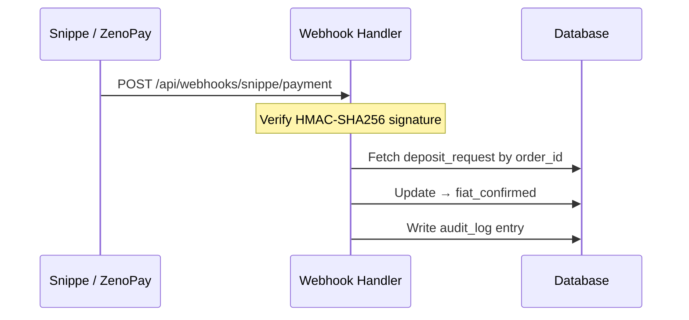
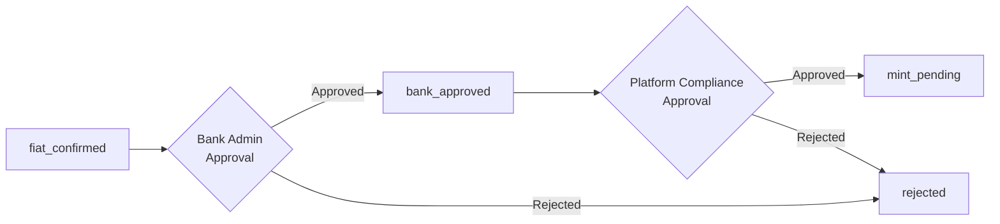
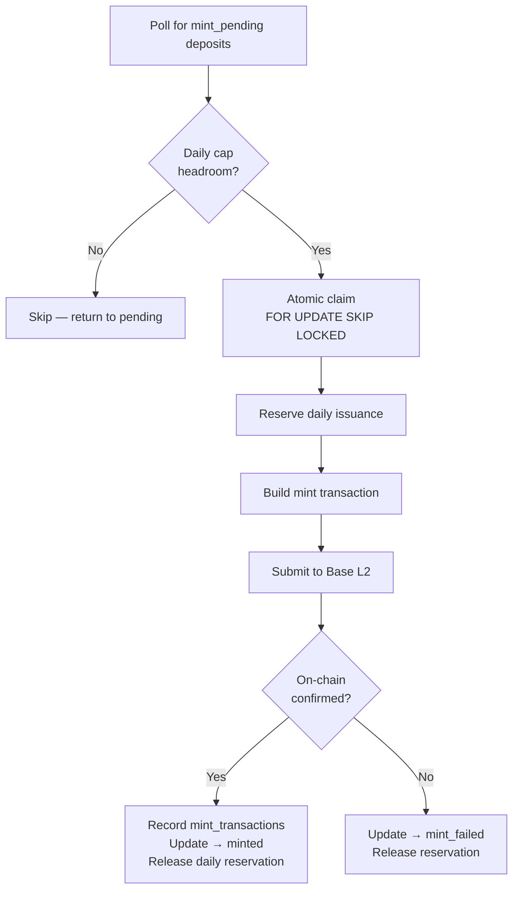

# 02 — Deposit to Mint Lifecycle

**Document owner**: NEDA Labs Limited  
**Last updated**: May 2026  
**Classification**: Regulatory — Bank of Tanzania Sandbox Submission

---

## 1. Overview

This document describes the complete end-to-end lifecycle for nTZS issuance — from a user initiating a TZS deposit through to tokens appearing in their on-chain wallet.

The primary off-chain record is the `deposit_requests` table. Every state transition is logged to `audit_logs`.

---

## 2. Deposit State Machine

```mermaid
stateDiagram-v2
    direction LR

    [*] --> submitted : User initiates deposit

    submitted --> kyc_pending : KYC check required
    kyc_pending --> kyc_approved : KYC approved by compliance
    kyc_pending --> kyc_rejected : KYC rejected
    kyc_approved --> awaiting_fiat : Awaiting payment confirmation
    submitted --> awaiting_fiat : KYC already approved

    awaiting_fiat --> fiat_confirmed : PSP webhook / polling confirms payment
    fiat_confirmed --> bank_approved : Bank approval recorded
    bank_approved --> platform_approved : Platform compliance approval
    platform_approved --> mint_pending : Ready for minting

    mint_pending --> mint_processing : Worker claims job (row lock)
    mint_processing --> minted : On-chain mint confirmed ✓
    mint_processing --> mint_failed : On-chain mint failed

    mint_failed --> mint_pending : Admin retries

    submitted --> cancelled : Payment initiation failed
    submitted --> rejected : Rejected during compliance review
    kyc_approved --> rejected : Rejected post-KYC
```

### State Descriptions

| State | Meaning |
|---|---|
| `submitted` | Deposit record created; PSP payment order issued |
| `kyc_pending` | User identity verification in progress |
| `kyc_approved` | KYC passed; awaiting fiat confirmation |
| `kyc_rejected` | KYC failed; deposit cannot proceed |
| `awaiting_fiat` | Waiting for mobile money / bank transfer confirmation |
| `fiat_confirmed` | PSP has confirmed receipt of TZS funds |
| `bank_approved` | Bank has reviewed and approved the deposit |
| `platform_approved` | Platform compliance has approved the deposit |
| `mint_pending` | Deposit queued for on-chain minting |
| `mint_processing` | Worker has claimed the job (row-locked) |
| `minted` | Tokens successfully minted to user wallet ✓ |
| `mint_failed` | On-chain mint transaction failed; retryable |
| `cancelled` | User or system cancelled before fiat confirmation |
| `rejected` | Rejected by compliance or bank; not minted |

---

## 3. How Deposits Are Created

### 3.1 Mobile Money (Snippe — primary PSP)

File: `apps/web/src/app/app/user/deposits/new/actions.ts`

1. User submits amount (TZS) and mobile phone number.
2. App inserts a `deposit_requests` row:
   - `status = submitted`
   - `payment_provider = snippe`
   - `buyer_phone` formatted to Tanzanian E.164 format
3. App calls Snippe API to create a payment order:
   - `order_id = deposit_requests.id`
   - `webhook_url = {APP_URL}/api/webhooks/snippe/payment`
4. Snippe pushes a USSD / M-Pesa prompt to the user's phone.

### 3.2 Card / Alternative (ZenoPay — secondary PSP)

1. Same flow as above with `payment_provider = zenopay`.
2. Webhook: `POST /api/webhooks/zenopay`

### 3.3 Bank Transfer

1. Deposit created as `submitted` with `payment_provider = bank_transfer`.
2. Fiat confirmation handled through admin/compliance workflow (out-of-band bank statement verification).
3. Admin manually advances deposit after verification.

---

## 4. Payment Confirmation Mechanisms

### 4.1 Webhook (preferred path)

- Snippe webhooks are HMAC-SHA256 signed using `SNIPPE_WEBHOOK_SECRET`.
- Handler verifies signature before processing.
- Handler only advances deposits in `submitted` / `awaiting_fiat` state.

### 4.2 Polling (fallback)

- Cron job (`/api/cron/poll-snippe`, `/api/cron/poll-zenopay`) periodically calls the PSP order-status API.
- Advances deposits where the PSP confirms payment but the webhook was not received.

### 4.3 Manual Admin Override

- Available in Backstage for cases where PSP data is unreliable.
- Admin enters the PSP transaction ID after verifying it independently in the PSP dashboard.
- All manual overrides are recorded in `audit_logs` with the acting admin's user ID.

---

## 5. Dual Approval Requirement

Before a deposit can reach `mint_pending`, it must pass two approval gates:

Both approvals are recorded in the `deposit_approvals` table with:
- Approver `user_id`
- Decision timestamp
- Optional notes

This two-gate structure ensures no single actor can unilaterally trigger token issuance.

---

## 6. Minting Worker Process

File: `apps/worker/src/index.ts` and `apps/web/src/app/api/cron/process-mints/route.ts`

Key properties:

| Property | Implementation |
|---|---|
| **Atomic job claim** | `FOR UPDATE SKIP LOCKED` — prevents double-processing |
| **Daily cap enforcement** | `daily_issuance` table; `reserved_tzs + issued_tzs ≤ cap_tzs` |
| **Single mint record** | `mint_transactions` has unique constraint on `deposit_request_id` |
| **On-chain verification** | Transaction receipt checked for successful `Transfer(0x0 → user, amount)` event |
| **Idempotency** | UUID deposit IDs used as PSP `order_id`; row conflict on re-insert |

---

## 7. Daily Issuance Cap

The `daily_issuance` table enforces a configurable per-day ceiling:

| Column | Purpose |
|---|---|
| `day` | UTC date (primary key) |
| `cap_tzs` | Maximum TZS issuable this day (default: 100,000,000) |
| `reserved_tzs` | Sum of in-flight (claimed but not yet minted) amounts |
| `issued_tzs` | Sum of successfully minted amounts for the day |

- **Reserve**: incremented atomically when worker claims a job
- **Release**: decremented if mint fails; converted to issued if mint succeeds
- **Rollover**: new row created automatically at UTC midnight

This cap applies to all minting paths including the standard worker flow.

---

## 8. Failure Modes and Recovery

| Failure | Symptom | Recovery |
|---|---|---|
| Webhook not received | Deposit stuck in `awaiting_fiat` | Cron polling picks it up automatically |
| PSP order-status unavailable | Polling cannot confirm | Admin manually advances via Backstage after PSP dashboard verification |
| RPC / network error | Deposit moves to `mint_failed` | Admin triggers retry from Backstage |
| Daily cap exceeded | Job skipped, remains `mint_pending` | Waits for UTC midnight rollover; or cap can be raised by super admin |
| Duplicate webhook delivery | Second webhook finds deposit no longer in advanceable state | No-op — state check prevents double-advancement |
| Mint transaction under-priced | `mint_failed` with gas error | Admin retries; worker uses current gas oracle |

---

## 9. Reconciliation

After minting, the on-chain `Transfer` event from the zero address is the canonical proof of issuance.

If the on-chain total supply diverges from `DB Minted`:

1. Identify the divergent transaction on-chain via Basescan.
2. Determine if a corresponding `deposit_request` exists.
3. If no corresponding deposit: create a `reconciliation_entries` row (types: `untracked_mint`, `test_mint`, `manual_correction`, `double_mint`, `opening_balance`, `other`).
4. Verify: **On-Chain Supply = DB Minted + Reconciliation Entries**.

The Oversight dashboard shows this calculation in real time.

---

## 10. Auditor Checks

- Verify `deposit_request` state transitions are monotonic and use authorized actors only.
- Verify every `minted` deposit has a corresponding `mint_transactions` row with a valid `tx_hash`.
- Verify `Transfer(from=0x0)` events on-chain match the `mint_transactions` records.
- Verify dual-approval (`deposit_approvals`) exists for all minted deposits.
- Verify daily issuance arithmetic: `reserved_tzs + issued_tzs ≤ cap_tzs` for each day.
- Verify no deposits were minted while in a non-approved state.
- Verify webhook signature validation is enforced on the Snippe handler (`SNIPPE_WEBHOOK_SECRET`).
