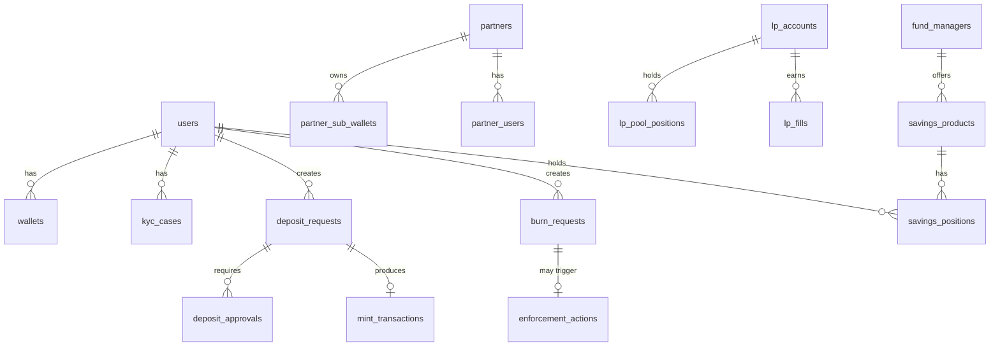

# 03 — Database Model

**Document owner**: NEDA Labs Limited  
**Last updated**: May 2026  
**Classification**: Regulatory — Bank of Tanzania Sandbox Submission

---

## 1. Overview

The database is **Neon PostgreSQL** (managed, EU Central region), accessed via **Drizzle ORM** with versioned migrations (32+ applied as of May 2026). It is the authoritative off-chain system of record for all platform activity. On-chain state (token supply, Transfer events) is the authoritative record for token issuance and is cross-checked against the database via the reconciliation system.

Schema source: `packages/db/src/schema.ts`

---

## 2. Domain Overview

---

## 3. Core Identity & Access Tables

### `users`

Primary identity record for all platform participants.

| Column | Type | Notes |
|---|---|---|
| `id` | uuid | Primary key |
| `neon_auth_user_id` | text | OAuth identity provider reference |
| `email` | varchar(320) | Unique |
| `name` | text | Display name |
| `role` | enum | `end_user`, `bank_admin`, `platform_compliance`, `super_admin`, `fund_manager`, `bot_regulator` |
| `pay_alias` | varchar(40) | Unique vanity payment alias |
| `fund_manager_id` | uuid | FK → `fund_managers` (if role is fund_manager) |
| `created_at` | timestamptz | — |

> `bot_regulator` is a read-only role for Bank of Tanzania sandbox observers.

---

### `wallets`

On-chain wallets per user per chain.

| Column | Type | Notes |
|---|---|---|
| `id` | uuid | Primary key |
| `user_id` | uuid | FK → `users` |
| `chain` | enum | `base`, `bnb`, `eth` |
| `address` | text | EVM address |
| `provider` | enum | `external`, `coinbase_embedded`, `platform_hd` |
| `frozen` | boolean | Default false — mirrors contract freeze state |
| `verification_method` | enum | `message_signature`, `micro_deposit`, `manual` |
| `verified_at` | timestamptz | — |

---

### `kyc_cases`

One KYC case per user. Tracks identity verification status.

| Column | Type | Notes |
|---|---|---|
| `id` | uuid | Primary key |
| `user_id` | uuid | FK → `users` |
| `status` | enum | `pending`, `approved`, `rejected` |
| `provider` | text | KYC provider name or "manual" |
| `reviewed_by` | uuid | FK → `users` (compliance officer) |
| `reviewed_at` | timestamptz | — |
| `review_reason` | text | Rejection reason |

---

### `kyc_documents`

Document files associated with a KYC case, stored in AWS S3.

| Column | Type | Notes |
|---|---|---|
| `id` | uuid | Primary key |
| `case_id` | uuid | FK → `kyc_cases` (cascade delete) |
| `document_type` | text | e.g. `national_id`, `proof_of_address` |
| `s3_key` | text | AWS S3 object key |
| `content_type` | text | MIME type |
| `size_bytes` | integer | — |

---

## 4. Deposit & Issuance Tables

### `deposit_requests`

Primary state machine for token issuance. See [02-DEPOSIT-TO-MINT-LIFECYCLE.md](./02-DEPOSIT-TO-MINT-LIFECYCLE.md) for the full state machine.

| Column | Type | Notes |
|---|---|---|
| `id` | uuid | Primary key — also used as PSP `order_id` |
| `user_id` | uuid | FK → `users` |
| `bank_id` | uuid | FK → `banks` |
| `wallet_id` | uuid | FK → `wallets` — destination wallet |
| `chain` | text | `base` or `bnb` |
| `amount_tzs` | bigint | Amount in TZS (no decimals) |
| `status` | enum | Full state machine — see doc 02 |
| `payment_provider` | text | `snippe`, `zenopay`, `bank_transfer` |
| `psp_reference` | text | PSP transaction / order reference |
| `psp_channel` | text | Payment channel (e.g. M-Pesa, Airtel) |
| `buyer_phone` | text | E.164 formatted phone number |
| `source` | text | `self`, `partner`, `waas` |
| `fiat_confirmed_at` | timestamptz | When PSP confirmed payment |
| `minted_at` | timestamptz | When on-chain mint completed |
| `payer_name` | text | Name from PSP confirmation |

---

### `deposit_approvals`

Dual-approval audit trail. One row per approval decision per deposit.

| Column | Type | Notes |
|---|---|---|
| `id` | uuid | Primary key |
| `deposit_request_id` | uuid | FK → `deposit_requests` |
| `approver_user_id` | uuid | FK → `users` |
| `approval_type` | text | `bank` or `platform` |
| `decision` | text | `approved` or `rejected` |
| `notes` | text | Optional compliance notes |
| `created_at` | timestamptz | — |

---

### `mint_transactions`

On-chain mint transaction record. One row per deposit (unique constraint on `deposit_request_id`).

| Column | Type | Notes |
|---|---|---|
| `id` | uuid | Primary key |
| `deposit_request_id` | uuid | Unique FK → `deposit_requests` |
| `chain` | text | Chain where mint occurred |
| `contract_address` | text | NTZSV2 proxy address |
| `tx_hash` | text | On-chain transaction hash |
| `status` | enum | `pending`, `minted`, `failed`, `cap_exceeded` |
| `error` | text | Error message if failed |
| `created_at` | timestamptz | — |

---

### `daily_issuance`

Per-UTC-day issuance cap tracking. Prevents over-issuance.

| Column | Type | Notes |
|---|---|---|
| `day` | date | Primary key (UTC date) |
| `cap_tzs` | bigint | Daily ceiling (default 100,000,000 TZS) |
| `reserved_tzs` | bigint | In-flight (claimed, not yet minted) |
| `issued_tzs` | bigint | Successfully minted today |

Invariant: `reserved_tzs + issued_tzs ≤ cap_tzs`

---

## 5. Withdrawal & Burn Tables

### `burn_requests`

Tracks user withdrawal requests and the on-chain burn execution. See [08-BURN-WITHDRAW-WORKFLOW.md](./08-BURN-WITHDRAW-WORKFLOW.md) for the full workflow.

| Column | Type | Notes |
|---|---|---|
| `id` | uuid | Primary key |
| `user_id` | uuid | FK → `users` |
| `wallet_id` | uuid | FK → `wallets` — source wallet |
| `amount_tzs` | bigint | Burn amount |
| `platform_fee_tzs` | bigint | Platform fee (0.5% of amount) |
| `reason` | text | Mandatory operator-provided reason |
| `status` | enum | `requested`, `requires_second_approval`, `approved`, `burn_submitted`, `burned`, `failed`, `rejected` |
| `requested_by_user_id` | uuid | Creating admin |
| `approved_by_user_id` | uuid | First approver |
| `approved_at` | timestamptz | — |
| `second_approved_by_user_id` | uuid | Second approver (if required) |
| `second_approved_at` | timestamptz | — |
| `tx_hash` | text | On-chain burn tx hash |
| `fee_tx_hash` | text | On-chain platform fee mint tx hash |
| `psp_payout_reference` | text | Snippe payout reference |
| `psp_payout_status` | text | `pending`, `completed`, `failed` |
| `psp_phone` | text | Recipient mobile money number |
| `error` | text | Failure reason |

---

## 6. Compliance & Enforcement Tables

### `enforcement_actions`

Immutable audit trail for all on-chain enforcement operations (freeze, blacklist, wipe).

| Column | Type | Notes |
|---|---|---|
| `id` | uuid | Primary key |
| `action_type` | enum | `freeze`, `unfreeze`, `blacklist`, `unblacklist`, `wipe` |
| `target_address` | text | Wallet address affected |
| `target_user_id` | uuid | FK → `users` (if known) |
| `performed_by_user_id` | uuid | Acting admin |
| `tx_hash` | text | On-chain transaction hash |
| `reason` | text | Mandatory legal/compliance reason |
| `legal_reference` | text | Court order / regulatory notice reference |
| `created_at` | timestamptz | — |

---

### `reconciliation_entries`

Accounts for on-chain supply not represented by a deposit request (test mints, manual mints, corrections).

| Column | Type | Notes |
|---|---|---|
| `id` | uuid | Primary key |
| `chain` | text | — |
| `tx_hash` | text | Unique — on-chain tx hash |
| `to_address` | text | Recipient address |
| `amount_tzs` | bigint | Amount (positive = mint, negative = correction) |
| `entry_type` | enum | `untracked_mint`, `test_mint`, `manual_correction`, `double_mint`, `opening_balance`, `other` |
| `reason` | text | Mandatory explanation |
| `notes` | text | Additional context |
| `created_by_user_id` | uuid | Compliance officer who created entry |
| `contract_address` | text | Contract that executed the mint |
| `created_at` | timestamptz | — |

**Dashboard formula**:
- `DB Minted` = Σ `deposit_requests.amount_tzs` WHERE status = `minted`
- `Reconciled` = Σ `reconciliation_entries.amount_tzs`
- `Total Tracked` = `DB Minted + Reconciled`
- `Discrepancy` = `On-Chain totalSupply − Total Tracked` (should be zero)

---

### `audit_logs`

Complete audit trail for all user and admin actions.

| Column | Type | Notes |
|---|---|---|
| `id` | uuid | Primary key |
| `user_id` | uuid | FK → `users` — acting user |
| `action` | text | Action name (e.g. `deposit.approved`, `user.freeze`) |
| `entity_type` | text | Table/entity affected |
| `entity_id` | text | ID of affected record |
| `metadata` | jsonb | Action-specific detail |
| `ip_address` | text | Client IP |
| `created_at` | timestamptz | Timestamp (stored UTC, displayed EAT in UI) |

---

## 7. Transfer Table

### `transfers`

Internal and partner-initiated token transfers (user-to-user, partner disbursements).

| Column | Type | Notes |
|---|---|---|
| `id` | uuid | Primary key |
| `from_user_id` | uuid | FK → `users` |
| `to_user_id` | uuid | FK → `users` |
| `from_wallet_id` | uuid | FK → `wallets` |
| `to_wallet_id` | uuid | FK → `wallets` |
| `token` | text | `ntzs`, `usdc`, `usdt` |
| `amount` | numeric | Human-readable amount |
| `chain` | text | `base` or `bnb` |
| `tx_hash` | text | On-chain tx hash |
| `to_address` | text | Destination address |
| `status` | text | `pending`, `completed`, `failed` |
| `partner_id` | uuid | FK → `partners` (if partner-initiated) |

---

## 8. WaaS Partner Tables

### `partners`

White-label API partner accounts.

| Column | Type | Notes |
|---|---|---|
| `id` | uuid | Primary key |
| `name` | text | Partner company name |
| `api_key_hash` | text | SHA-256 hash of issued API key |
| `webhook_url` | text | Partner's webhook endpoint |
| `webhook_secret` | text | HMAC secret for webhook delivery |
| `hd_seed_encrypted` | text | AES-256-GCM encrypted HD wallet seed |
| `next_sub_wallet_index` | integer | HD derivation index counter |
| `treasury_wallet_address` | text | Partner treasury address |
| `daily_limit_tzs` | bigint | Optional per-day transaction limit |
| `fee_percent` | numeric | Platform fee rate |
| `payout_type` | text | `mobile`, `bank` |
| `payout_phone` | text | Mobile money settlement number |
| `suspended_at` | timestamptz | Non-null = suspended |
| `suspend_reason` | text | — |

---

### `partner_sub_wallets`

HD-derived wallets provisioned for each WaaS user.

| Column | Type | Notes |
|---|---|---|
| `id` | uuid | Primary key |
| `partner_id` | uuid | FK → `partners` |
| `label` | text | User-facing label |
| `address` | text | EVM address |
| `wallet_index` | integer | BIP-44 derivation index |

---

### `partner_users`

Links external partner users to platform user records.

| Column | Type | Notes |
|---|---|---|
| `id` | uuid | Primary key |
| `partner_id` | uuid | FK → `partners` |
| `external_user_id` | text | Partner's own user identifier |
| `user_id` | uuid | FK → `users` |

---

### `partner_webhook_events`

Tracks webhook delivery attempts and retries to partner endpoints.

| Column | Type | Notes |
|---|---|---|
| `id` | uuid | Primary key |
| `partner_id` | uuid | FK → `partners` |
| `event_type` | text | e.g. `deposit.confirmed`, `swap.completed` |
| `payload` | jsonb | Event body |
| `delivered_at` | timestamptz | First successful delivery |
| `attempts` | integer | Delivery attempt count |
| `last_error` | text | Most recent delivery error |

---

## 9. SimpleFX LP Tables

### `lp_accounts`

Liquidity provider accounts for the SimpleFX FX pool.

| Column | Type | Notes |
|---|---|---|
| `id` | uuid | Primary key |
| `email` | varchar(320) | Unique — LP identity |
| `display_name` | text | — |
| `wallet_address` | text | Unique — derived HD wallet |
| `wallet_index` | integer | Unique — BIP-44 index |
| `bid_bps` | integer | Bid spread in basis points |
| `ask_bps` | integer | Ask spread in basis points |
| `is_active` | boolean | Whether LP pool is active |
| `onboarding_step` | integer | Current onboarding step (1–3) |
| `kyc_status` | enum | `pending`, `approved`, `rejected` |
| `api_key_hash` | text | SHA-256 hash of MM API key |

---

### `lp_otp_codes`

Email-based OTP codes for LP authentication.

| Column | Type | Notes |
|---|---|---|
| `id` | uuid | Primary key |
| `email` | varchar(320) | — |
| `code_hash` | text | SHA-256 hash of 6-digit code |
| `expires_at` | timestamptz | 10-minute expiry |
| `used` | boolean | Default false — consumed after successful auth |

---

### `lp_fx_pairs`

Configured trading pairs for the FX pool.

| Column | Type | Notes |
|---|---|---|
| `id` | uuid | Primary key |
| `base_token` | text | e.g. `ntzs` |
| `quote_token` | text | e.g. `usdc`, `usdt` |
| `base_chain` | text | `base`, `bnb` |
| `quote_chain` | text | `base`, `bnb` |
| `is_active` | boolean | — |
| `base_decimals` | integer | e.g. 18 |
| `quote_decimals` | integer | e.g. 6 |

---

### `lp_fx_config`

Single-row global FX configuration table.

| Column | Type | Notes |
|---|---|---|
| `id` | integer | Always 1 |
| `mid_rate_tzs_per_usdc` | numeric | Reference mid-rate |
| `updated_at` | timestamptz | Last manual update |

---

### `lp_pool_positions`

Per-LP per-token liquidity position tracking.

| Column | Type | Notes |
|---|---|---|
| `id` | uuid | Primary key |
| `lp_id` | uuid | FK → `lp_accounts` |
| `token` | text | `ntzs`, `usdc`, `usdt` |
| `chain` | text | `base`, `bnb` |
| `contributed` | numeric | Amount contributed to pool |
| `earned` | numeric | Spread earnings accumulated |

---

### `lp_fills`

Individual trade fills executed from LP liquidity.

| Column | Type | Notes |
|---|---|---|
| `id` | uuid | Primary key |
| `lp_id` | uuid | FK → `lp_accounts` |
| `pair_id` | uuid | FK → `lp_fx_pairs` |
| `user_address` | text | End-user wallet |
| `from_token` | text | Token sold by user |
| `to_token` | text | Token received by user |
| `from_amount` | numeric | Input amount |
| `to_amount` | numeric | Output amount |
| `spread_earned` | numeric | LP's spread capture |
| `in_tx_hash` | text | User's inbound tx |
| `out_tx_hash` | text | LP's outbound fill tx |
| `source` | text | `user`, `partner` |
| `partner_id` | uuid | FK → `partners` (if partner-sourced) |
| `created_at` | timestamptz | — |

---

### `lp_wallet_transactions`

LP wallet deposit / withdrawal / sweep history.

| Column | Type | Notes |
|---|---|---|
| `id` | uuid | Primary key |
| `lp_id` | uuid | FK → `lp_accounts` |
| `type` | enum | `deposit`, `withdrawal`, `activation_sweep`, `deactivation_return` |
| `token` | text | — |
| `chain` | text | — |
| `amount` | numeric | — |
| `source` | text | `mpesa`, `onchain`, `system` |
| `tx_hash` | text | On-chain tx hash |
| `created_at` | timestamptz | — |

---

## 10. Savings / Yield Tables

### `fund_managers`

Licensed fund managers who offer savings products on the platform.

| Column | Type | Notes |
|---|---|---|
| `id` | uuid | Primary key |
| `name` | text | — |
| `contact_email` | varchar(320) | — |
| `license_number` | text | Regulatory licence reference |
| `agreement_signed_at` | timestamptz | Platform agreement date |
| `tvl_limit_tzs` | bigint | Maximum TVL allowed |
| `status` | enum | `active`, `paused`, `terminated` |

---

### `savings_products`

Investment products with defined yield rates and lock periods.

| Column | Type | Notes |
|---|---|---|
| `id` | uuid | Primary key |
| `fund_manager_id` | uuid | FK → `fund_managers` |
| `name` | text | — |
| `annual_rate_bps` | integer | Annual yield in basis points |
| `lock_days` | integer | Minimum holding period |
| `min_deposit_tzs` | bigint | Minimum deposit |
| `max_deposit_tzs` | bigint | Maximum deposit (nullable = unlimited) |
| `status` | enum | `active`, `paused`, `closed` |

---

### `savings_positions`

User's active position in a savings product.

| Column | Type | Notes |
|---|---|---|
| `id` | uuid | Primary key |
| `user_id` | uuid | FK → `users` |
| `wallet_id` | uuid | FK → `wallets` |
| `product_id` | uuid | FK → `savings_products` |
| `principal_tzs` | bigint | Current principal |
| `accrued_yield_tzs` | bigint | Accrued but unclaimed yield |
| `annual_rate_bps` | integer | Rate at position open (locked) |
| `status` | enum | `active`, `closed` |
| `last_accrual_at` | timestamptz | Last yield calculation |
| `matures_at` | timestamptz | Lock expiry date |

---

### `yield_accruals`

Daily yield accrual records — immutable audit trail.

| Column | Type | Notes |
|---|---|---|
| `id` | uuid | Primary key |
| `position_id` | uuid | FK → `savings_positions` |
| `date` | text | UTC date string |
| `principal_tzs` | bigint | Principal at accrual time |
| `rate_bps` | integer | Annual rate applied |
| `accrued_tzs` | bigint | Yield credited this day |

---

## 11. Auditor Checks

- Verify `deposit_requests` state transitions are monotonic and performed by authorized roles only.
- Verify every `minted` deposit has a `mint_transactions` row with `tx_hash` matching an on-chain `Transfer(from=0x0)` event.
- Verify `deposit_approvals` exists for every minted deposit (both bank and platform approvals).
- Verify `daily_issuance` arithmetic: `reserved_tzs + issued_tzs ≤ cap_tzs` for each UTC day.
- Verify `reconciliation_entries` are only created by `platform_compliance` or `super_admin` users.
- Verify `enforcement_actions` rows exist for every on-chain freeze/blacklist/wipe event, with a reason and legal reference.
- Verify `burn_requests` with amounts ≥ 9,000 TZS passed through `requires_second_approval` state.
- Verify `audit_logs` entries exist for all sensitive operations with non-null `user_id`.
- Verify `lp_otp_codes.used = true` for all consumed codes; no reuse after expiry.
