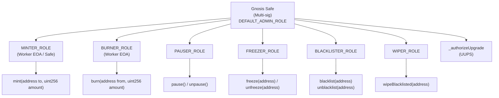
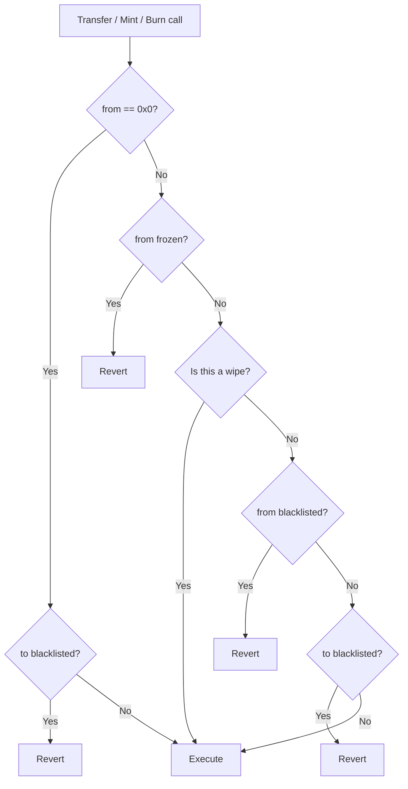

# 04 — Smart Contract

**Document owner**: NEDA Labs Limited  
**Last updated**: May 2026  
**Classification**: Regulatory — Bank of Tanzania Sandbox Submission

---

## 1. Deployment

| Contract | Chain | Address | Version |
|---|---|---|---|
| nTZS Token (proxy) | Base Mainnet | `0xF476BA983DE2F1AD532380630e2CF1D1b8b10688` | NTZSV2 |
| nTZS Token (proxy) | BNB Smart Chain | Configurable | NTZSV2 |
| Admin Gnosis Safe | Base Mainnet | `0xB2b8C08a9AEB0E22242e6fC9cD78FC2402cBC503` | Gnosis Safe |

- Source: `packages/contracts/contracts/NTZSV2.sol`
- Proxy pattern: **UUPS (Universal Upgradeable Proxy Standard)** — EIP-1822
- Block explorer: [Basescan](https://basescan.org/token/0xF476BA983DE2F1AD532380630e2CF1D1b8b10688)
- Audited findings resolved: see [07-AUDIT-RESPONSE.md](./07-AUDIT-RESPONSE.md)

---

## 2. Token Specification

| Property | Value |
|---|---|
| Name | `nTZS` |
| Symbol | `nTZS` |
| Decimals | 18 |
| Standard | ERC-20 |
| Supply model | Issued 1:1 against TZS deposits; burned 1:1 on withdrawal |
| No pre-mint | Tokens are only created in response to verified deposits |
| Upgradeable | Yes — UUPS proxy; upgrade restricted to `DEFAULT_ADMIN_ROLE` |

---

## 3. Role-Based Access Control

The contract uses **OpenZeppelin AccessControlUpgradeable**. Roles are assigned as `bytes32` identifiers and checked on every privileged function.



### Role Descriptions

| Role | Holder | Purpose |
|---|---|---|
| `DEFAULT_ADMIN_ROLE` | Gnosis Safe (multi-sig) | Grant/revoke all roles; authorize upgrades |
| `MINTER_ROLE` | Worker EOA + Safe | Issue new tokens against confirmed TZS deposits |
| `BURNER_ROLE` | Worker EOA | Destroy tokens when users withdraw TZS |
| `PAUSER_ROLE` | Safe | Emergency halt of all transfers |
| `FREEZER_ROLE` | Safe / Compliance admin | Temporarily prevent transfers from a specific address |
| `BLACKLISTER_ROLE` | Safe / Compliance admin | Permanently block an address; prerequisite for wipe |
| `WIPER_ROLE` | Safe | Seize / destroy balance of a blacklisted address |

### Initialization

`initialize(address safeAdmin)` is called once on proxy deployment:
- Grants `safeAdmin` all operational roles listed above.
- `safeAdmin` is the Gnosis Safe address.
- Implementation contract calls `_disableInitializers()` in its constructor — prevents direct initialization of the implementation.

---

## 4. Public Functions

### Minting

```solidity
function mint(address to, uint256 amount) external onlyRole(MINTER_ROLE)
```

- Creates `amount` tokens and assigns them to `to`.
- Requires `to` is not blacklisted.
- Emits `Transfer(address(0), to, amount)` — canonical issuance signal.
- Blocked when contract is paused.

### Burning

```solidity
function burn(address from, uint256 amount) external onlyRole(BURNER_ROLE)
```

- Destroys `amount` tokens from `from`.
- Requires `from` has sufficient balance.
- Emits `Transfer(from, address(0), amount)` — canonical redemption signal.
- **Blocked when contract is paused.**

### Pause / Unpause

```solidity
function pause()   external onlyRole(PAUSER_ROLE)
function unpause() external onlyRole(PAUSER_ROLE)
```

- When paused: all `transfer`, `transferFrom`, and `burn` are blocked.
- `wipeBlacklisted` **remains permitted** during pause for enforcement continuity.

### Account Freeze

```solidity
function freeze(address account)   external onlyRole(FREEZER_ROLE)
function unfreeze(address account) external onlyRole(FREEZER_ROLE)
```

- **Frozen accounts** can receive tokens but cannot transfer out.
- Reverts if account is already in the target state (idempotency protection).
- Emits `Frozen(account)` / `Unfrozen(account)`.

### Account Blacklist

```solidity
function blacklist(address account)   external onlyRole(BLACKLISTER_ROLE)
function unblacklist(address account) external onlyRole(BLACKLISTER_ROLE)
```

- **Blacklisted accounts** cannot send or receive tokens.
- Blacklisting is a prerequisite for `wipeBlacklisted`.
- Reverts if account is already in the target state.
- Emits `Blacklisted(account)` / `Unblacklisted(account)`.

### Wipe

```solidity
function wipeBlacklisted(address account) external onlyRole(WIPER_ROLE)
```

- Destroys the **entire balance** of a blacklisted account.
- Requires account is currently blacklisted.
- Permitted even while contract is paused (enforcement cannot be blocked by a pause).
- Emits `Wiped(account, amount)` + `Transfer(account, address(0), amount)`.

---

## 5. Transfer Restriction Logic

The contract overrides OpenZeppelin's `_update` internal function:



### Summary Matrix

| Scenario | Allowed? |
|---|---|
| Mint to normal address | ✓ |
| Mint to blacklisted address | ✗ |
| Transfer from frozen address | ✗ |
| Transfer to frozen address | ✓ (receive only) |
| Transfer from blacklisted address | ✗ |
| Transfer to blacklisted address | ✗ |
| Wipe of blacklisted address | ✓ (even while paused) |
| Burn while paused | ✗ |
| Normal transfer while paused | ✗ |

---

## 6. Events

All events are emitted on-chain and constitute the canonical audit trail for supply changes:

| Event | Signature | Trigger |
|---|---|---|
| `Transfer` | `Transfer(address indexed from, address indexed to, uint256 value)` | Every mint, burn, transfer, wipe |
| `Frozen` | `Frozen(address indexed account)` | `freeze()` |
| `Unfrozen` | `Unfrozen(address indexed account)` | `unfreeze()` |
| `Blacklisted` | `Blacklisted(address indexed account)` | `blacklist()` |
| `Unblacklisted` | `Unblacklisted(address indexed account)` | `unblacklist()` |
| `Wiped` | `Wiped(address indexed account, uint256 amount)` | `wipeBlacklisted()` |
| `Paused` | `Paused(address account)` | `pause()` |
| `Unpaused` | `Unpaused(address account)` | `unpause()` |
| `RoleGranted` | `RoleGranted(bytes32 role, address account, address sender)` | `grantRole()` |
| `RoleRevoked` | `RoleRevoked(bytes32 role, address account, address sender)` | `revokeRole()` |

---

## 7. Upgrade Path

UUPS upgrade flow:

1. New implementation contract (`NTZSV3.sol`) is developed and audited.
2. Gnosis Safe proposes an upgrade transaction calling `upgradeToAndCall(newImpl, calldata)`.
3. Multi-sig signers (quorum required) approve the Safe transaction.
4. `_authorizeUpgrade` verifies caller has `DEFAULT_ADMIN_ROLE`.
5. Proxy storage slot updated to point to new implementation.
6. All existing balances, roles, and state are preserved.

Test contract for upgrade continuity: `packages/contracts/contracts/NTZSV3.sol`

---

## 8. Auditor Checks

- Verify `DEFAULT_ADMIN_ROLE` is held exclusively by the Gnosis Safe (not an EOA).
- Verify `MINTER_ROLE` is restricted to the authorized worker EOA and/or Safe.
- Verify no role has been granted to unauthorized addresses via `RoleGranted` events.
- Verify `_authorizeUpgrade` cannot be bypassed — only `DEFAULT_ADMIN_ROLE` can trigger upgrade.
- Verify `_disableInitializers()` is called in the implementation constructor.
- Verify transfer restrictions: frozen accounts cannot send; blacklisted cannot send or receive; wipe bypasses pause.
- Verify `burn` is blocked while paused; `wipeBlacklisted` is not.
- Verify every freeze/blacklist/wipe event in `enforcement_actions` DB table corresponds to an on-chain event.
