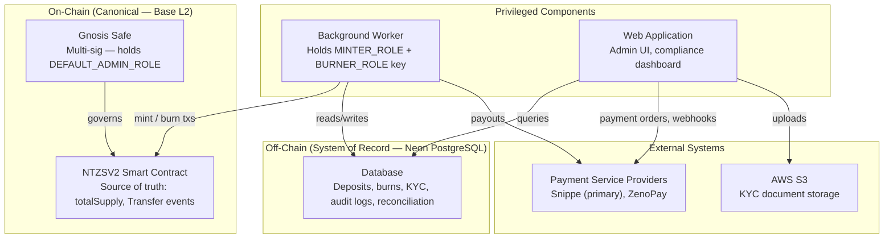

# 05 — Security Model and Threats

**Document owner**: NEDA Labs Limited  
**Last updated**: May 2026  
**Classification**: Regulatory — Bank of Tanzania Sandbox Submission

---

## 1. Trust Architecture

**Principle**: On-chain `totalSupply` and `Transfer` events are the **sole canonical source** of token supply. The database is the system of record for off-chain activity. Neither alone is complete — reconciliation cross-checks both.

---

## 2. Assets to Protect

| Asset | Risk if Compromised | Controls |
|---|---|---|
| `MINTER_PRIVATE_KEY` | Unlimited token issuance | Stored as env secret; rotation procedure; daily cap as backstop |
| `BURNER_PRIVATE_KEY` | Destruction of user balances | Stored as env secret; burn requires DB-backed approval workflow |
| Gnosis Safe signing keys | Full admin takeover | Multi-sig quorum required; hardware keys recommended |
| `DATABASE_URL` | Data manipulation, record forgery | On-chain supply is canonical; reconciliation detects DB/chain divergence |
| `SNIPPE_API_KEY` / `SNIPPE_WEBHOOK_SECRET` | Fraudulent payment confirmations | Webhook signature enforced; state-machine guards prevent reprocessing |
| `WAAS_ENCRYPTION_KEY` | Partner HD seed decryption | AES-256-GCM; key stored separately from encrypted data |
| Admin account credentials | Unauthorized approvals or enforcement actions | OAuth (Neon Auth); role-based access; audit log on all actions |
| `FX_JWT_SECRET` / `FX_HD_MNEMONIC` | LP session hijack / wallet theft | Stored in app-level env; not in client bundle |

---

## 3. Threat Model

### 3.1 Unauthorized Minting

**Risk**: Attacker gains `MINTER_PRIVATE_KEY` and mints tokens without corresponding TZS deposits.

**Mitigations**:
- Key stored only in worker environment secrets — never in source code or client bundle.
- On-chain `daily_issuance` cap enforced off-chain; over-issuance immediately visible on Oversight dashboard via `totalSupply` vs DB minted discrepancy.
- Monitor `Transfer(from=0x0)` events on-chain — unexpected mints trigger alerts.
- For high-value mints: Gnosis Safe multi-sig required; single key insufficient.
- Key rotation procedure defined in Operations Runbook.

---

### 3.2 Duplicate / Replay Mint

**Risk**: Worker processes the same deposit twice, issuing double tokens.

**Mitigations**:
- Atomic job claim: `SELECT ... FOR UPDATE SKIP LOCKED` — prevents two workers claiming the same job.
- `mint_transactions` table has a unique constraint on `deposit_request_id` — DB rejects a second mint record.
- Deposit state transitions are monotonic — a `minted` deposit cannot return to `mint_pending`.

---

### 3.3 Fraudulent Payment Confirmation (Webhook Spoofing)

**Risk**: Attacker POST-s to `/api/webhooks/snippe/payment` to fake a payment confirmation.

**Mitigations**:
- All Snippe webhooks are HMAC-SHA256 signed. Handler rejects requests failing signature verification (`SNIPPE_WEBHOOK_SECRET`).
- Handler only advances deposits in the correct predecessor state — cannot advance an already-confirmed deposit.
- ZenoPay webhooks: IP whitelisting recommended; signature verification implemented where supported.
- Canonical fallback: PSP order-status polling cross-checks webhook claims.

---

### 3.4 PSP Impersonation / Man-in-the-Middle

**Risk**: Attacker intercepts or replays PSP API responses to manipulate deposit status.

**Mitigations**:
- All PSP API calls made over TLS (HTTPS).
- PSP API keys stored as server-side secrets; never exposed to client.
- Polling fallback reads directly from PSP API with authenticated credentials.
- Manual admin override requires explicit operator verification before use.

---

### 3.5 Database Compromise

**Risk**: Attacker gains write access to the database and alters records.

**Mitigations**:
- Database is **not the canonical authority** for token supply — on-chain state supersedes it.
- `reconciliation_entries` mechanism detects any DB/chain divergence.
- Least-privilege DB credentials — application uses a single connection role with no DDL rights.
- Audit logs stored in DB; critical events also emitted on-chain (via smart contract events).
- Neon PostgreSQL point-in-time recovery available for forensic analysis.

---

### 3.6 Wallet Key Compromise (WaaS / HD Wallets)

**Risk**: Partner HD seeds are stolen, allowing derivation of all partner user wallets.

**Mitigations**:
- Partner HD seeds are stored **AES-256-GCM encrypted** in the database (`partners.hd_seed_encrypted`).
- Encryption key (`WAAS_ENCRYPTION_KEY`) is stored separately in environment secrets — not in the DB.
- LP wallet mnemonic (`FX_HD_MNEMONIC`) stored only in app-level env; not in DB.
- All wallet derivation follows BIP-44 standard (`m/44'/8453'/1'/0/{index}`).
- Relayer pre-funds wallets with minimal ETH for gas only — no token balances held by relayer.

---

### 3.7 Smart Contract Vulnerability

**Risk**: Bug in NTZSV2 allows unauthorized minting, burning, or privilege escalation.

**Mitigations**:
- Contract audited by third-party auditor; all findings resolved (see [07-AUDIT-RESPONSE.md](./07-AUDIT-RESPONSE.md)).
- UUPS upgrade pattern allows patching without migrating token balances.
- `DEFAULT_ADMIN_ROLE` (upgrade authority) held by multi-sig Safe — single actor cannot upgrade.
- OpenZeppelin v5 base contracts — battle-tested implementations for ERC-20, AccessControl, Pausable.
- Emergency pause halts all transfers pending investigation.

---

### 3.8 Unauthorized LP Session / API Key

**Risk**: Attacker hijacks an LP session or MM API key to manipulate FX pool positions.

**Mitigations**:
- LP dashboard uses email OTP authentication with 10-minute code expiry.
- OTP codes are SHA-256 hashed before storage — plaintext never persisted.
- OTP consumed atomically — one-time use enforced at DB level.
- MM API keys are SHA-256 hashed; plaintext shown only once on generation.
- JWT session cookies: `httpOnly`, `secure`, `sameSite=lax`, `path=/simplefx` — scoped to LP subdirectory.
- Key rotation: `POST /api/v1/partners/regenerate-key`.

---

### 3.9 Insider Threat (Admin Abuse)

**Risk**: Authorized admin uses compliance tools (freeze, blacklist, wipe) abusively.

**Mitigations**:
- Every enforcement action requires a mandatory `reason` and `legal_reference` field.
- All actions recorded in `enforcement_actions` (DB) and emitted as on-chain events — immutable dual audit trail.
- Gnosis Safe multi-sig required for high-privilege on-chain actions — no single signatory can act alone.
- Oversight dashboard visible to `platform_compliance`, `super_admin`, and `bot_regulator` (Bank of Tanzania) roles.
- Two-person approval required for large burns (≥ 9,000 TZS) and deposits.

---

## 4. Security Invariants

These invariants must hold at all times. Any violation indicates a security incident:

| Invariant | How to verify |
|---|---|
| `On-chain totalSupply = DB Minted + Reconciliation` | Oversight dashboard discrepancy field; `/api/oversight/reserves-report` |
| Every `Transfer(0x0 → addr)` has a `mint_transactions` row | Cross-reference `mint_transactions.tx_hash` with Basescan |
| No `Transfer(addr → 0x0)` without a `burn_requests` row in `burned` state | Cross-reference `burn_requests.tx_hash` with Basescan |
| `MINTER_ROLE` is held only by authorized addresses | Read `RoleGranted` events from contract; verify against expected addresses |
| `DEFAULT_ADMIN_ROLE` is held only by the Gnosis Safe | Read `RoleGranted` events; verify no EOA holds this role |
| `deposit_approvals` exists for every `minted` deposit | SQL: `deposit_requests JOIN deposit_approvals` where status = `minted` |
| `lp_otp_codes.used = true` for all verified sessions | SQL: `lp_otp_codes` where `used = false` AND `expires_at < now()` should be empty (or pruned) |

---

## 5. Audit Focus Areas

- Smart contract access control configuration and role assignment
- Worker minting logic: atomicity, idempotency, cap enforcement
- Deposit advancement authorization: who can advance and under what conditions
- Webhook signature verification implementation
- HD wallet seed encryption and key management
- LP OTP implementation: hashing, expiry, single-use enforcement
- Admin audit trail completeness: no sensitive operation without an `audit_logs` entry
- Gnosis Safe configuration: quorum threshold, signer addresses
