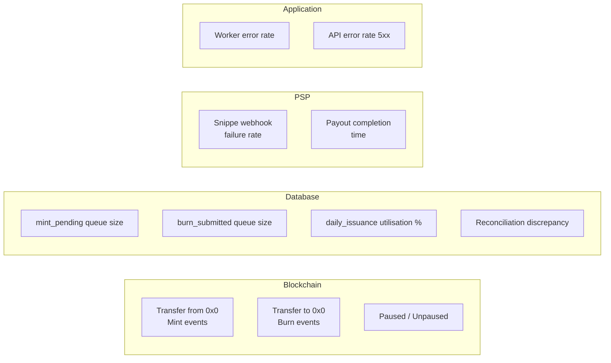
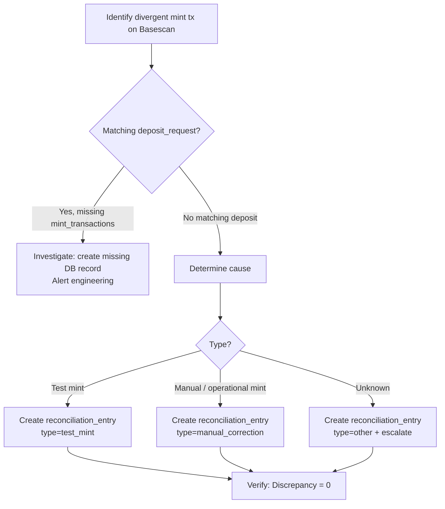

# 06 — Operations Runbook

**Document owner**: NEDA Labs Limited  
**Last updated**: May 2026  
**Classification**: Regulatory — Bank of Tanzania Sandbox Submission

---

## 1. Environments

| Environment | Chain | Contract Address | Purpose |
|---|---|---|---|
| **Production** | Base Mainnet (8453) | `0xF476BA983DE2F1AD532380630e2CF1D1b8b10688` | Live token operations |
| **Staging / Testnet** | Base Sepolia | `0x6A9525A5C82F92E10741Fcdcb16DbE9111630077` | Integration testing |

---

## 2. Required Secrets / Configuration

All secrets are stored as environment variables. Never commit to source control.

### Core

| Variable | Required | Description |
|---|---|---|
| `DATABASE_URL` | ✓ | Neon PostgreSQL connection string (with `sslmode=require`) |
| `BASE_RPC_URL` | ✓ | Alchemy Base mainnet RPC endpoint |
| `NTZS_CONTRACT_ADDRESS_BASE` | ✓ | NTZSV2 proxy address on Base |
| `NEXT_PUBLIC_APP_URL` | ✓ | Public base URL (used for webhooks, redirects) |
| `APP_SECRET` | ✓ | General application secret |

### Minting & Burning

| Variable | Required | Description |
|---|---|---|
| `MINTER_PRIVATE_KEY` | ✓ | EOA private key with `MINTER_ROLE` |
| `RELAYER_PRIVATE_KEY` | ✓ | EOA for gas pre-funding new wallets |
| `RELAYER_WALLET_ADDRESS` | ✓ | Address of the relayer EOA |
| `DAILY_ISSUANCE_CAP_TZS` | ✓ | Daily issuance ceiling (default: `100000000`) |
| `PLATFORM_TREASURY_ADDRESS` | ✓ | Receives 0.5% platform fee mints |

### Payment Service Providers

| Variable | Required | Description |
|---|---|---|
| `SNIPPE_API_KEY` | ✓ | Bearer token for Snippe API |
| `SNIPPE_WEBHOOK_SECRET` | ✓ | HMAC-SHA256 secret for webhook verification |

### Authentication & Security

| Variable | Required | Description |
|---|---|---|
| `NEON_AUTH_URL` | ✓ | Neon Auth endpoint |
| `FX_JWT_SECRET` | ✓ | LP dashboard session JWT secret (`openssl rand -hex 32`) |
| `FX_HD_MNEMONIC` | ✓ | BIP-39 mnemonic for LP HD wallet derivation |
| `WAAS_ENCRYPTION_KEY` | ✓ | AES-256 key for partner HD seed encryption (64 hex chars) |
| `CRON_SECRET` | ✓ | Authorization token for cron endpoint calls |
| `INTERNAL_API_SECRET` | ✓ | Service-to-service authentication secret |

### AWS S3 (KYC Documents)

| Variable | Required | Description |
|---|---|---|
| `AWS_REGION` | ✓ | `eu-west-1` |
| `S3_BUCKET_KYC` | ✓ | S3 bucket name for KYC documents |
| `AWS_ACCESS_KEY_ID` | Dev only | Use IAM roles in production |
| `AWS_SECRET_ACCESS_KEY` | Dev only | Use IAM roles in production |

### Email (OTP)

| Variable | Required | Description |
|---|---|---|
| `SMTP_HOST` | ✓ | SMTP server hostname |
| `SMTP_PORT` | ✓ | Default: `587` |
| `SMTP_USER` | ✓ | SMTP login |
| `SMTP_PASS` | ✓ | SMTP password / App Password |
| `SMTP_FROM` | ✓ | From address (e.g. `SimpleFX <noreply@ntzs.co.tz>`) |

---

## 3. Starting Services

### Web Application

```bash
cd apps/web
pnpm dev        # development
pnpm build && pnpm start  # production
```

The web app exposes:
- User portal: `/app`
- LP portal: `/simplefx`
- Merchant portal: `/merchant`
- Oversight: `/app/oversight`
- REST API: `/api/v1`
- Cron endpoints: `/api/cron/*` (protected by `CRON_SECRET`)
- Webhook endpoints: `/api/webhooks/*`

### Background Worker

```bash
cd apps/worker
pnpm dev        # development
pnpm start      # production
```

The worker runs a continuous polling loop:
- **Burn processor**: checks for `approved` burn requests every `WORKER_POLL_INTERVAL_MS` (default 5s)
- **Snippe payout reconciler**: polls Snippe for payout status on `burn_submitted` requests
- **Yield accrual**: triggered daily via cron (`/api/cron/accrue-yield`)
- **Merchant settlement**: triggered via cron (`/api/cron/process-settlements`)

### Cron Schedules

| Endpoint | Schedule | Purpose |
|---|---|---|
| `/api/cron/process-mints` | Every 30s | Process `mint_pending` deposit queue |
| `/api/cron/poll-snippe` | Every 60s | Poll Snippe for payment/payout status |
| `/api/cron/poll-zenopay` | Every 60s | Poll ZenoPay for payment status |
| `/api/cron/accrue-yield` | Daily 00:05 UTC | Accrue savings product yields |
| `/api/cron/bot-alert` | Every 5min | Check SimpleFX market maker status |

All cron calls include header `Authorization: Bearer {CRON_SECRET}`.

---

## 4. Monitoring

### Key Signals



### Oversight Dashboard

Access at `/app/oversight` (requires `platform_compliance` or `super_admin` role).

Displays:
- **On-chain supply** vs **DB minted** — discrepancy must be zero (or explained by reconciliation entries)
- **Daily issuance utilisation** — colour-coded: green <70%, amber 70–90%, red >90%
- **KYC pipeline** — pending / approved / rejected counts
- **Deposit status breakdown** — counts and TZS amounts per state
- **Recent deposits and withdrawals** — with PSP references and tx hashes
- **Audit log** — all admin actions with actor and timestamp (EAT)

### Alert Conditions

| Condition | Action |
|---|---|
| On-chain supply ≠ DB Minted + Reconciled | Immediate investigation — see Reconciliation Procedure |
| `mint_failed` deposits accumulating | Check RPC health; check `MINTER_PRIVATE_KEY` has `MINTER_ROLE` |
| Daily cap > 90% utilized | Notify compliance team; consider raising cap if legitimate |
| Snippe webhook failure rate > 10% | Check `NEXT_PUBLIC_APP_URL` is reachable; check HMAC secret |
| Worker process not running | Restart worker container; alert on-call engineer |
| Unexpected `Transfer(from=0x0)` on-chain | Potential unauthorized mint — pause token immediately |

---

## 5. Handling Common Issues

### Webhook Not Firing

**Symptom**: Deposits stuck in `awaiting_fiat` after user confirms payment.

**Actions**:
1. Verify `NEXT_PUBLIC_APP_URL` is publicly reachable from the internet.
2. Verify Snippe is configured to POST to `{APP_URL}/api/webhooks/snippe/payment`.
3. Check webhook logs in Snippe dashboard for delivery errors.
4. Cron polling (`/api/cron/poll-snippe`) provides automatic fallback — wait one polling cycle.

---

### Deposit Stuck in `fiat_confirmed`

**Symptom**: Payment confirmed but deposit not advancing to `mint_pending`.

**Actions**:
1. Check that a bank admin has approved the deposit in Backstage → Deposits.
2. Check that a compliance admin has approved the deposit in Backstage → Deposits.
3. If approval was done but state didn't update, check for `audit_logs` errors.

---

### Mint Failures

**Symptom**: Deposits stuck in `mint_failed`.

**Actions**:
1. Check RPC availability: `curl {BASE_RPC_URL} -X POST -d '{"jsonrpc":"2.0","method":"eth_blockNumber","params":[],"id":1}'`
2. Verify `MINTER_PRIVATE_KEY` account has `MINTER_ROLE`: query `hasRole(MINTER_ROLE, address)` on-chain.
3. Verify minter account has sufficient ETH for gas.
4. From Backstage → Deposits, use the **Retry** action.
5. If systematic failure, check worker logs for error messages.

---

### Daily Issuance Cap Exceeded

**Symptom**: Worker skipping deposits; `mint_transactions.status = cap_exceeded`.

**Actions**:
1. Check current utilization on Oversight dashboard.
2. Wait for UTC midnight rollover (new `daily_issuance` row created).
3. If legitimate demand warrants it, super admin can raise `DAILY_ISSUANCE_CAP_TZS` environment variable and redeploy.

---

### PSP Payout Stuck / Failed

**Symptom**: Burn is `burn_submitted` but payout not completed after 30 minutes.

**Actions**:
1. Check Snippe dashboard for payout reference status.
2. Check `burn_requests.psp_payout_status` in database.
3. If Snippe confirms failure, use admin reconcile endpoint: `POST /api/admin/burns/{id}/reconcile` with `{ "mode": "auto" }`.
4. If payout needs to be retried with a different number, use `force_revert` mode and create a new burn.

---

### Snippe Order Status Unreliable

**Actions**:
1. Use Backstage manual transaction ID input after independently verifying the payment in Snippe dashboard.
2. All manual overrides are recorded in `audit_logs` with the acting admin's user ID.

---

## 6. Gnosis Safe Operations

For high-privilege on-chain operations (role grant/revoke, contract upgrade, pause):

1. Connect to Safe at `https://app.safe.global` using Safe address `0xB2b8C08a9AEB0E22242e6fC9cD78FC2402cBC503`.
2. Propose a transaction (requires one signatory to initiate).
3. Collect required signature quorum from other signatories.
4. Execute the transaction.

**Safe operations require**:
- Granting / revoking any role
- Upgrading the contract implementation
- Pausing / unpausing the token
- Blacklisting / wiping an address

---

## 7. Reconciliation Procedure

If the Oversight dashboard shows a non-zero discrepancy (`On-Chain Supply ≠ Total Tracked`):



Only `platform_compliance` or `super_admin` users can create reconciliation entries.

---

## 8. Key Rotation

### Minter Key

1. Generate a new EOA private key.
2. Fund the new EOA with ETH for gas.
3. Using the Gnosis Safe: `grantRole(MINTER_ROLE, newAddress)`.
4. Update `MINTER_PRIVATE_KEY` in worker environment and redeploy.
5. Using the Gnosis Safe: `revokeRole(MINTER_ROLE, oldAddress)`.
6. Verify the old key no longer has `MINTER_ROLE`.

### API Keys (Partners / LPs)

- Partners: `POST /api/v1/partners/regenerate-key` — invalidates old key immediately.
- LP MM keys: regenerated via LP dashboard settings.

### SMTP / PSP Credentials

- Update environment variable and redeploy web app.
- No on-chain action required.

---

## 9. Incident Response

### Suspected Unauthorized Mint

1. **Immediate**: Pause token via Gnosis Safe → `pause()`.
2. Check `Transfer(from=0x0)` events on Basescan for unexpected mints.
3. Identify the minting address and check if it matches `MINTER_PRIVATE_KEY` EOA.
4. If key is compromised: revoke `MINTER_ROLE` via Safe immediately.
5. Assess affected addresses.
6. Create reconciliation entries to document unauthorized mints.
7. Produce incident report for Bank of Tanzania notification.
8. Resume operations only after key rotation and root cause confirmed.

### Regulatory Freeze / Seizure Request

1. Receive written instruction from Bank of Tanzania or other authorized authority.
2. Record instruction in `enforcement_actions` with `legal_reference` field.
3. Via Gnosis Safe: call `freeze(address)` or `blacklist(address)` and `wipeBlacklisted(address)`.
4. Confirm on-chain event emitted.
5. Notify the regulator with on-chain transaction hash.
6. All steps are permanently recorded in `enforcement_actions` and on-chain events.

### Token Contract Upgrade

1. Deploy new implementation contract (audited and tested).
2. Gnosis Safe proposes `upgradeToAndCall(newImpl, "")`.
3. Collect multi-sig quorum.
4. Execute upgrade.
5. Verify proxy now delegates to new implementation.
6. All balances and roles are preserved — no migration needed.
