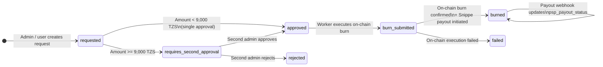
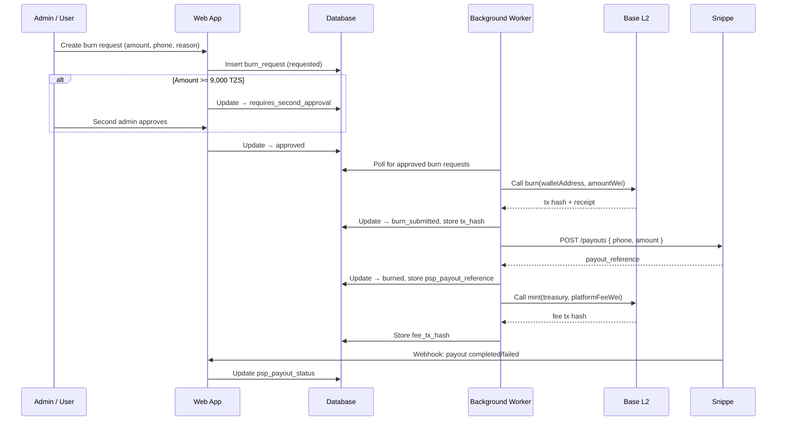

# 08 — Burn / Withdraw Workflow

**Document owner**: NEDA Labs Limited  
**Last updated**: May 2026  
**Classification**: Regulatory — Bank of Tanzania Sandbox Submission

---

## 1. Overview

A withdrawal (burn) reduces the on-chain token supply 1:1 and triggers a TZS payout to the user's mobile money account via Snippe. The process is fully auditable: every step is recorded in the database with mandatory reason fields, and the on-chain burn transaction serves as the canonical proof of supply reduction.

**Key flows**:
1. User or admin initiates a burn request in the platform
2. Dual-approval required for amounts ≥ 9,000 TZS
3. Background worker executes `burn()` on-chain and initiates Snippe payout
4. Platform fee (0.5%) is minted to the treasury wallet as a separate transaction

---

## 2. Burn State Machine



### State Descriptions

| State | Meaning |
|---|---|
| `requested` | Burn request created; pending first approval |
| `requires_second_approval` | Amount ≥ threshold; awaiting second admin approval |
| `approved` | Approved and queued for on-chain execution |
| `burn_submitted` | On-chain transaction submitted; awaiting confirmation |
| `burned` | Burn confirmed on-chain; Snippe payout initiated |
| `failed` | On-chain execution failed; error recorded |
| `rejected` | Request rejected by approving admin |

---

## 3. End-to-End Flow



---

## 4. Authorization & Roles

| Layer | Requirement |
|---|---|
| On-chain `burn()` | Caller must hold `BURNER_ROLE` on NTZSV2 |
| On-chain `mint()` (platform fee) | Caller must hold `MINTER_ROLE` on NTZSV2 |
| DB approval — first | `super_admin` or `platform_compliance` role |
| DB approval — second | `super_admin` role (for amounts ≥ threshold) |

The worker EOA configured via `MINTER_PRIVATE_KEY` / `RELAYER_PRIVATE_KEY` holds both `MINTER_ROLE` and `BURNER_ROLE` at the smart contract level.

---

## 5. Platform Fee

For every successful burn, a platform fee of **0.5%** of the burn amount is collected:

```
platform_fee_tzs = floor(amount_tzs × 0.005)
```

This fee is:
1. Recorded in `burn_requests.platform_fee_tzs`
2. Minted on-chain to `PLATFORM_TREASURY_ADDRESS` after the burn is confirmed
3. The mint transaction hash stored in `burn_requests.fee_tx_hash`

The platform fee mint is a separate transaction from the burn and can be distinguished by the recipient address.

---

## 6. Dual-Approval Threshold

```
SAFE_BURN_THRESHOLD_TZS = 9,000
```

| Amount | Approval path |
|---|---|
| < 9,000 TZS | Single approval by any `super_admin` |
| ≥ 9,000 TZS | First approval → `requires_second_approval` → second admin approval |

All approvals are recorded in `burn_requests` with:
- `approved_by_user_id` + `approved_at`
- `second_approved_by_user_id` + `second_approved_at` (when applicable)

---

## 7. On-Chain Execution Details

```solidity
function burn(address from, uint256 amount) external onlyRole(BURNER_ROLE)
```

- `amountWei = amount_tzs × 10^18` (nTZS uses 18 decimals)
- Requires the `from` address has sufficient balance
- **Blocked while contract is paused** — burns cannot execute during an emergency pause
- Emits `Transfer(from, address(0), amount)` — canonical signal of supply reduction on Basescan

Worker verifies the transaction receipt before marking as `burned` — partial confirmation is not accepted.

---

## 8. Snippe Payout Integration

After on-chain burn confirmation, the worker initiates a Snippe payout:

| Parameter | Value |
|---|---|
| Recipient | `burn_requests.psp_phone` |
| Amount | `burn_requests.amount_tzs` minus Snippe flat fee (1,500 TZS) |
| Reference | `burn_requests.id` |
| Webhook | `{APP_URL}/api/webhooks/snippe/payout` |

### Payout Status Tracking

`burn_requests.psp_payout_status`:

| Status | Meaning |
|---|---|
| `pending` | Payout created; awaiting Snippe processing |
| `completed` | Snippe confirms successful mobile money delivery |
| `failed` | Snippe reports payout failure |

### Payout Failure Recovery

If Snippe payout fails:
1. Worker logs the failure and records `psp_payout_status = failed`.
2. Note: the on-chain burn has **already occurred** — tokens are destroyed regardless.
3. Admin uses Backstage reconciliation: `POST /api/admin/burns/{id}/reconcile`.
4. Recovery options: retry payout with corrected phone number, or issue manual refund via new deposit.

---

## 9. Database Fields Reference

Table: `burn_requests`

| Field | Type | Notes |
|---|---|---|
| `id` | uuid | Primary key |
| `user_id` | uuid | FK → `users` — token holder |
| `wallet_id` | uuid | FK → `wallets` — source wallet |
| `amount_tzs` | bigint | Gross burn amount |
| `platform_fee_tzs` | bigint | Platform fee (0.5%) |
| `reason` | text | **Mandatory** — operator reason |
| `status` | enum | Lifecycle state (see §2) |
| `requested_by_user_id` | uuid | Admin who created request |
| `approved_by_user_id` | uuid | First approver |
| `approved_at` | timestamptz | First approval time |
| `second_approved_by_user_id` | uuid | Second approver (if required) |
| `second_approved_at` | timestamptz | Second approval time |
| `tx_hash` | text | On-chain burn tx hash |
| `fee_tx_hash` | text | Platform fee mint tx hash |
| `psp_payout_reference` | text | Snippe payout ID |
| `psp_payout_status` | text | `pending`, `completed`, `failed` |
| `psp_phone` | text | Recipient mobile money number |
| `error` | text | Failure details if `failed` |

---

## 10. UI Surfaces

### Admin — Backstage (`/backstage/burns`)

- Create burn request
- First and second approval workflow
- Execute burn (triggers worker claim)
- View status, tx hashes, payout reference
- Reconcile failed payouts

### User — Dashboard (`/app/user`)

- Burns displayed as negative amounts in "Recent Transactions"
- Full transaction history at `/app/user/activity`

---

## 11. Auditor Checks

- Verify only `BURNER_ROLE` can call `burn()` on-chain — check `hasRole(BURNER_ROLE, workerAddress)`.
- Verify `burn()` is blocked while contract is paused; `wipeBlacklisted()` is not.
- Verify every `burn_requests` row with status `burned` has a non-null `tx_hash` matching a `Transfer(to=0x0)` event on Basescan.
- Verify dual-approval (`second_approved_by_user_id`) exists for all burns with `amount_tzs ≥ 9000`.
- Verify `reason` field is non-null for all burn requests.
- Verify platform fee mint (`fee_tx_hash`) for each burned request.
- Verify `platform_fee_tzs = floor(amount_tzs × 0.005)` for all entries.
- Verify `Transfer(to=PLATFORM_TREASURY_ADDRESS)` on-chain matches `fee_tx_hash` records.
- Verify Snippe flat fee (1,500 TZS) is correctly deducted from user's net payout.
