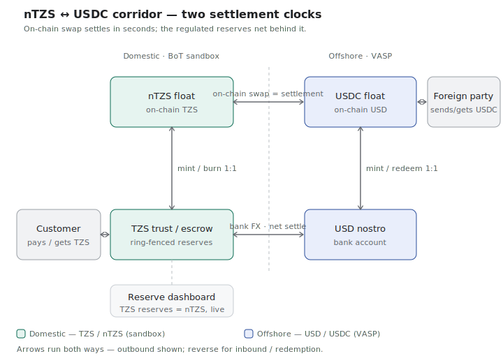

# nTZS Issuance & Redemption Protocol

**Prepared by:** NEDA LABS Company Limited
**For:** Bank of Tanzania — Fintech Regulatory Sandbox (Ref. LD.170/515/02/1254)
**Submission item:** §7(c) — issuance and redemption protocol, diagrammatic token flow, and smart-contract control documentation
**Status:** Draft for counsel / regulator review · *fields in `[brackets]` to be completed*
**Version:** 0.1 · [date]

---

## 1. Purpose & scope

This document describes how the nTZS tokenised stablecoin is **issued, transferred, redeemed, and used in cross-currency settlement** during the Bank of Tanzania (BoT) Fintech Regulatory Sandbox test, and the controls that keep it compliant with the approved Testing Parameters.

nTZS is a Tanzanian-Shilling-pegged digital token, backed on a strict **1:1 basis** by TZS-denominated reserves (cash and short-term government securities) held in a **ring-fenced trust/escrow account** at a BoT-licensed commercial bank. nTZS is **not legal tender**, is restricted to approved sandbox participants, and **all customer-facing settlement is in TZS**.

## 2. Parties & roles

| Party | Role | Sits in | Permission |
|---|---|---|---|
| **NEDA LABS Co. Ltd** | Issuer/administrator of nTZS; controls mint & burn; operates the wallet/payment UX | Tanzania | BoT sandbox participant |
| **[Partner Bank]** (BoT-licensed) | Trustee/custodian of TZS reserves; **FX principal** (TZS↔USD); TZS settlement; AML/CFT | Tanzania | Banking & FX licence (letter §6) |
| **[Offshore VASP]** | Facilitates the USDC float; USD↔USDC via Circle; on-chain USDC counterparty for cross-border | [Jurisdiction] | Foreign VASP/MSB licence — **outside** the sandbox |
| **[PSP(s)]** (e.g. Snippe, AzamPay) | Mobile-money / bank pay-in and pay-out of TZS | Tanzania | BoT-licensed PSP |

No single party performs both the TZS reserve function and the USDC function; each acts only within its own licence and jurisdiction.

## 3. The two settlement clocks (overview)

The corridor runs on two decoupled "clocks":

- **Fast clock (on-chain, ~seconds):** cross-currency value moves as an instant `nTZS ↔ USDC` swap between two 1:1 reserve-backed instruments. Because each is fully backed, the swap *is* the settlement.
- **Slow clock (regulated fiat, net/batched):** the underlying reserves — TZS in the bank's trust, USD in the nostro — rebalance the floats periodically, net of inbound and outbound, through the bank's licensed FX function.

## 4. Issuance (mint) — strictly after cash

1. Customer initiates a TZS pay-in via a licensed **PSP** (mobile money or bank).
2. Funds settle into the **ring-fenced trust account** at [Partner Bank]. The bank confirms receipt.
3. **Only after** confirmed receipt of the equivalent TZS in trust, NEDA's issuance contract **mints nTZS 1:1** to the customer's wallet.
4. The mint event and the reserve increment are reflected in the **real-time reserve dashboard** (§7), keeping `TZS reserves = nTZS issued` at all times.

> **Control:** nTZS is never minted before the equivalent cash is in trust (no "fake electronic money"). The mint authority is technically gated on a confirmed-deposit reference; see §8.

## 5. Redemption (burn)

1. Holder requests redemption (or a TZS payout).
2. NEDA's contract **burns** the nTZS.
3. The equivalent TZS is **released from the trust account** by [Partner Bank] and paid to the beneficiary **in TZS** via PSP/bank rails.
4. The dashboard decrements issued supply against reserves, preserving the 1:1.

## 6. Cross-currency settlement (FX)

When value crosses currency (e.g. inbound USD/USDC → TZS payout, or TZS → USD/USDC abroad):

1. The **bank's FX desk is the principal and price-setter** for TZS↔USD — the regulated FX occurs onshore, under BoT's purview.
2. The on-chain leg is an **atomic delivery-versus-delivery (DvP)** swap: NEDA delivers/burns the **nTZS** leg; [Offshore VASP] delivers/receives the **USDC** leg; the exchange executes **at the bank's rate** in a single transaction.
3. Because the swap is atomic, neither party holds the other's instrument beyond the instant of settlement — **no foreign stablecoin enters Tanzania, and no unbacked nTZS leaves**.
4. All USD↔USDC activity (Circle Mint / OTC) is performed **offshore** by [Offshore VASP]. The only domestic touchpoints are the bank's USD nostro (a normal correspondent flow) and the atomic on-chain settlement.
5. Inbound and outbound flows **net against each other**, so the working floats stay small and no party pre-funds gross volume.

## 7. Reserve management & 1:1 backing

- Customer funds are held in a **single, ring-fenced trust/escrow account** at [Partner Bank], segregated from NEDA's operational funds; no rehypothecation; no yield/staking.
- A **real-time reserve dashboard** provides BoT and the parties with continuous visibility of **fiat reserves vs. tokens issued**. Target invariant at all times: `TZS reserves ≥ nTZS issued`.
- Independent reconciliation runs continuously (reserve balance ↔ on-chain token supply), with automated alerting on any divergence beyond tolerance.
- Bank-issued reserve attestations are produced [frequency] for the record.

## 8. Smart-contract control points

| Control | Mechanism |
|---|---|
| **Mint authority** | Restricted to NEDA's issuance service, gated on a confirmed trust-account deposit reference. No open minting. |
| **Burn authority** | Restricted to redemption/payout flow; burns are recorded against released TZS. |
| **Swap (DvP)** | Fixed-rule atomic exchange at the bank-provided rate; no discretionary pricing by NEDA; per-transaction and inventory limits enforced on-chain. |
| **Pause / kill-switch** | The parties (and BoT, on direction) can halt minting and/or swaps; redemptions remain available. |
| **Limits** | Per-transaction and aggregate caps; rate-staleness guard (no fill on a stale price). |
| **Auditability** | Every mint/burn/swap is on-chain and timestamped; off-chain references link to PSP and bank records. |

Full contract addresses, ABIs, role assignments, and limit parameters are provided in the accompanying smart-contract control schedule [attachment].

## 9. Compliance mapping (to the BoT approval letter)

| Step | Rule satisfied |
|---|---|
| Customer pays/receives TZS | §4 — customer-facing settlement is in TZS |
| Ring-fenced trust account | §6 — TZS reserve custody, single controlled account |
| Mint only after cash | §4 peg + §7(d) risk plan (no fake e-money) |
| On-chain swap among participants | §4 — not legal tender / not a parallel currency; restricted to participants |
| Bank as FX principal | §6 — FX conversion is the bank's function |
| USDC offshore only | keeps §4 scope (domestic stays TZS-only) |
| Reserve dashboard | §6 — real-time reserves vs. tokens |
| Floats earn nothing | §4 — no staking/yield without approval |

## 10. Glossary

- **DvP (delivery-versus-delivery):** an atomic on-chain exchange where both legs settle together or not at all.
- **Float:** a small working balance (nTZS or USDC) sized to net intra-cycle imbalance, not gross volume.
- **Net settlement:** periodic rebalancing of fiat reserves for the net of inbound vs. outbound, rather than per-transaction wires.
- **VASP:** Virtual Asset Service Provider, licensed for digital-asset activity in its jurisdiction.

---

*This protocol is read together with the nTZS Risk Management Plan (§7(d)) and the reserve-dashboard specification.*
