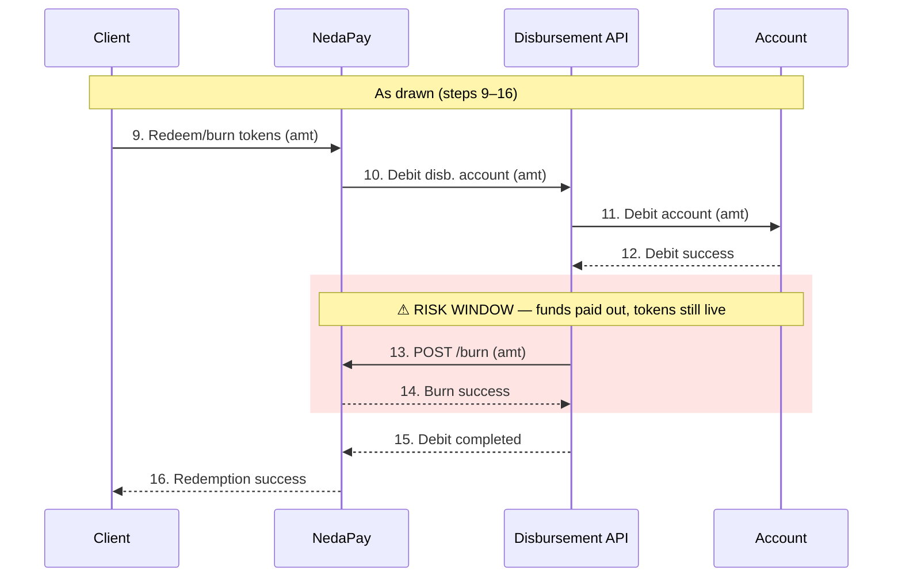
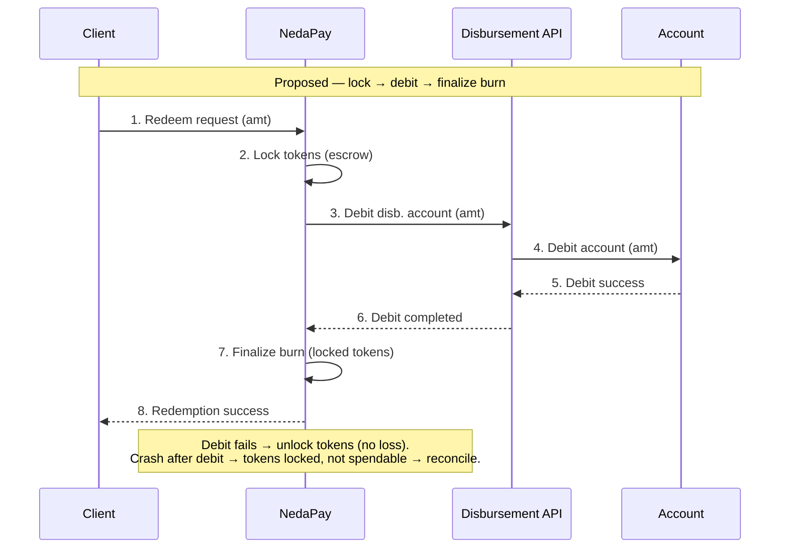
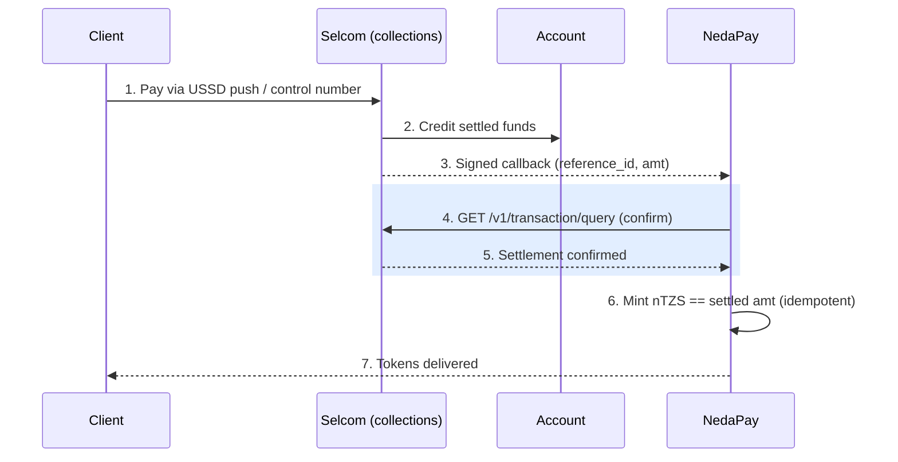

# nTZS × Selcom — Security Controls & Flow Review

**Prepared by:** NedaPay (NEDA Labs)
**Date:** 6 July 2026
**Re:** Requested controls for the unified Selcom custodian / disbursement account (mint + burn), ahead of go-live
**Audience:** Selcom — Dhimant Jadeja (cc Sameer, Alyoce FM, Rosario Arun)

---

## Context

nTZS is a fully fiat-backed stablecoin: every token in circulation is backed 1:1 by TZS held at Selcom (SMFB) as custodian. In the proposed flow, a **single Selcom account** is credited on mint (purchase) and debited on burn (redemption).

Consolidating to one account gives us clean 1:1 reconciliation — but it also means the **entire reserve is reachable by the disbursement API**. The controls below cap the blast radius of any credential compromise while preserving that clean reconciliation. Most are requests to confirm/enable on Selcom's side; a few are questions.

---

## 1. Account-level controls (Selcom)

Because a single signing-key compromise could otherwise reach the full reserve, we would like to enforce:

| # | Control | Purpose | Proposed starting value (to tune to live volume) |
|---|---------|---------|--------------------------------------------------|
| 1 | **Per-transaction cap** | Bound any single payout | ≤ 5,000,000 TZS; above → manual approval |
| 2 | **Daily disbursement cap** | Bound total daily API payout | ~50,000,000 TZS / day |
| 3 | **Velocity limit** | Stop rapid drain | ≤ 10,000,000 TZS/hour or ≤ 20 payouts/hour |
| 4 | **Admin-approval threshold (dual control)** | Second-human sign-off on large moves | single > 2,000,000 TZS, or cumulative > 20,000,000 TZS/day |
| 5 | **Production IP whitelisting** | API accepts calls only from our fixed egress IP(s) | Enabled in production |
| 6 | **Reserve segregation (preferred)** | Expose only an operational float to the API; hold the bulk of the reserve in an SMFB sub-account the disbursement API cannot debit | Confirm feasibility |

**Questions:** Which of #1–#4 can Selcom's *Transaction Rules* / *Admin Approvals* enforce today? And for #6 — can the "unified" account still be structured so the API only ever reaches a float, with the reserve held behind it?

---

## 2. Mint / burn trigger endpoints (NedaPay ← Selcom)

Selcom's flow calls our `POST /mint` and `POST /burn`. **`POST /mint` authorizes token issuance, so it must be non-forgeable.** To secure it, we need from Selcom:

- **Signed callbacks** — an HMAC/RSA signature (or mutual TLS) on the callback so we can verify authenticity. Today the disbursement callback carries no signature.
- **A stable idempotency key** on each callback (`reference_id` / `selcom_receipt`) so retries cannot double-mint or double-burn.
- **Static source IP(s)** for Selcom's callback origin, so we can allowlist them.

On our side we will: verify the signature + source IP, **independently confirm settlement via `GET /v1/transaction/query` before minting** (never mint on the instruction alone), dedupe by reference, and assert `on-chain supply == reserve balance` after every mint/burn.

---

## 3. Frequency & abuse controls (below-threshold attempts)

Per-transaction caps alone don't stop a "salami" drain — many payouts each *under* the cap. The aggregate limits in §1 (#2–#4) are the primary defence; to close the gap we additionally ask:

- **Count-based velocity limits**, not only amount-based — e.g. **≤ 20 payouts/hour and ≤ 200 payouts/day** via the API, regardless of size. A flood of tiny payouts should be bounded too.
- **Beneficiary-level limits** — max amount and count per destination account per day (e.g. ≤ 3 payouts / ≤ 5,000,000 TZS per beneficiary per day).
- **New-beneficiary cooldown** — a delay or lower cap for first-time destination accounts, so a compromised key can't immediately drain to fresh mule accounts.
- **Limit-trip alerting & auto-suspend** — when any rule in §1 or above trips, notify us in real time (email/webhook) and optionally auto-suspend API disbursements pending manual re-enable.

We will mirror equivalent limits in our application layer (rate limiting, per-user redemption velocity, circuit breaker) so neither side is a single point of failure.

**Question:** which of these can Transaction Rules express today (count-based, per-beneficiary, cooldowns), and does the portal support limit-trip notifications?

---

## 4. Two flow adjustments to discuss

- **Burn ordering** — the flow debits the account (steps 10–12) *before* the tokens are burned (13–14). A failure in between leaves funds paid out but tokens un-burned (under-collateralized). Preferred: reserve/lock the tokens first, or burn-then-pay, or a two-phase **authorize → confirm** so we can guarantee atomicity. At minimum we will run a reconciliation to catch "debited but not burned."

- **Mint entry point** — the flow shows NedaPay instructing "Credit Disbursement Account" (step 2), but a real customer deposit is client-initiated (USSD / control number). We will gate minting on the client's **actually-received, settled funds**. Please confirm how customer collections settle into this account once the collection (push-USSD / control-number) flow is live.

### Figure 1 — Redemption ordering: as drawn (risk window) vs proposed

### Figure 2 — Mint entry point: gate on settled funds

---

## 5. Open items to close on the call

- Confirm which controls in §1 are available now vs. need enablement, and §1.6 feasibility.
- Signed callbacks + static callback IP(s) for §2.
- Count-based / per-beneficiary rules + limit-trip notifications (§3).
- Collections (push-USSD / control-number): ETA, settlement timing (T+0 / T+1), and how funds land in this account.
- Production FI codes (Vodacom / bank) + valid purpose codes.
- Government levy applicability on wallet/bank sends (charges are inclusive of VAT + excise; levy applies "where applicable").

---

*Proposed limit values are conservative starting points and will be tuned to observed transaction volumes after go-live. Our disbursement integration (wallet, bank, and internal rails) has already been validated end-to-end against the Selcom sandbox.*
